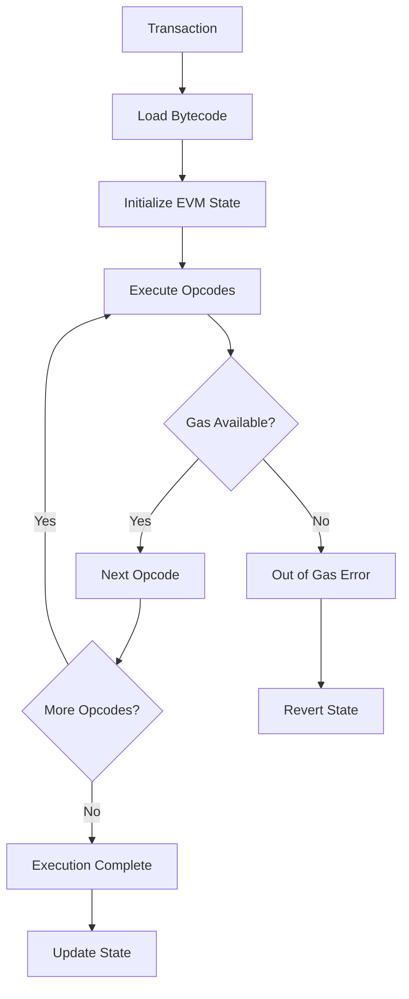

# Developer Guide - Zig EVM

## Welcome to Zig EVM Development! 🚀

This comprehensive guide will help you understand, contribute to, and build upon the Zig EVM implementation. Whether you're new to blockchain development, EVM internals, or the Zig programming language, this guide provides everything you need to get started.

## Table of Contents

1. [Quick Start](#quick-start)
2. [Understanding the EVM](#understanding-the-evm)
3. [Codebase Architecture](#codebase-architecture)
4. [Development Environment Setup](#development-environment-setup)
5. [Building and Testing](#building-and-testing)
6. [Contributing Guidelines](#contributing-guidelines)
7. [API Reference](#api-reference)
8. [Common Use Cases](#common-use-cases)
9. [Performance Optimization](#performance-optimization)
10. [Troubleshooting](#troubleshooting)

---

## Quick Start

### Prerequisites

- **Zig 0.15.1** or later ([Download here](https://ziglang.org/download/))
- **Git** for version control
- **Basic knowledge** of blockchain concepts (recommended)

### Get Up and Running in 5 Minutes

```bash
# 1. Clone the repository
git clone https://github.com/your-org/zig-evm
cd zig-evm

# 2. Run the basic EVM demo
zig run src/main.zig
# Output: Execution completed successfully, Result: 14

# 3. Run comprehensive tests
zig build test
# Output: All 145+ tests pass

# 4. Try the parallel execution demo
zig run src/benchmark_demo.zig
# Output: Performance benchmark results

# 5. Explore the codebase
ls -la src/
ls -la docs/
```

**🎉 Congratulations!** You now have a working EVM implementation.

---

## Understanding the EVM

### What is the Ethereum Virtual Machine?

The Ethereum Virtual Machine (EVM) is a **stack-based virtual machine** that executes smart contracts on the Ethereum blockchain. Think of it as a decentralized computer that runs the same program (smart contract) across thousands of nodes worldwide.

### Key EVM Concepts

#### 1. **Stack-Based Architecture**
```
Stack (LIFO - Last In, First Out)
┌─────────────┐
│     42      │ ← Top of stack
├─────────────┤
│    100      │
├─────────────┤
│     7       │ ← Bottom
└─────────────┘

Operations like ADD pop two values, add them, and push the result back.
```

#### 2. **Memory Model**
- **Stack**: 1024 items maximum, for temporary computation
- **Memory**: Linear, expandable byte array for temporary data
- **Storage**: Persistent key-value store (survives between transactions)

#### 3. **Gas System**
```
Gas = Computational Resource Unit
┌─────────────────┬──────────┐
│ Operation       │ Gas Cost │
├─────────────────┼──────────┤
│ ADD, SUB, MUL   │    3     │
│ SLOAD (storage) │   200    │
│ SSTORE (storage)│  5000    │
└─────────────────┴──────────┘
```

#### 4. **Opcodes (Operation Codes)**
```
Bytecode: [0x60, 0x03, 0x60, 0x04, 0x01]
          PUSH1 3, PUSH1 4, ADD

Execution:
1. PUSH1 3  → Stack: [3]
2. PUSH1 4  → Stack: [4, 3]
3. ADD      → Stack: [7]     (4 + 3 = 7)
```

### EVM Execution Flow



---

## Codebase Architecture

### High-Level Structure

```
zig-evm/
├── src/
│   ├── main.zig              # Core EVM implementation
│   ├── bigint.zig            # 256-bit arithmetic engine
│   ├── stack.zig             # EVM stack implementation
│   ├── memory.zig            # EVM memory management
│   ├── parallel.zig          # Parallel execution framework
│   ├── parallel_optimized.zig # Advanced optimizations
│   └── opcodes/              # Individual opcode implementations
│       ├── add.zig           # ADD opcode (0x01)
│       ├── mul.zig           # MUL opcode (0x02)
│       └── ...               # 80+ opcodes
├── tests/                    # Comprehensive test suite
├── docs/                     # Documentation
└── build.zig                 # Build configuration
```

### Core Components

#### 1. **EVM Struct** (`src/main.zig`)
```zig
pub const EVM = struct {
    allocator: Allocator,
    stack: Stack,              // Computation stack
    memory: Memory,            // Temporary memory
    pc: usize,                 // Program counter
    gas: u64,                  // Remaining gas
    gas_limit: u64,           // Transaction gas limit
    code: []const u8,         // Bytecode to execute
    accounts: HashMap,         // Account states
    // ... environmental context
};
```

#### 2. **BigInt** (`src/bigint.zig`)
```zig
pub const BigInt = struct {
    data: [4]u64,  // 4 × 64-bit = 256-bit

    // Core operations
    pub fn add(a: BigInt, b: BigInt) BigInt
    pub fn mul(a: BigInt, b: BigInt) BigInt
    pub fn div(a: BigInt, b: BigInt) BigInt
    // ... 20+ operations
};
```

#### 3. **Opcode System** (`src/opcodes/`)
```zig
// Each opcode follows this pattern
pub fn getImpl() struct { code: u8, impl: OpcodeImpl } {
    return .{
        .code = 0x01,  // ADD opcode
        .impl = .{ .execute = execute },
    };
}

fn execute(evm: *EVM) !void {
    const b = try evm.stack.pop();
    const a = try evm.stack.pop();
    const result = a.add(b);
    try evm.stack.push(result);
}
```

### Parallel Execution Architecture

```
┌─────────────────────────────────────────────────────────────┐
│                    Parallel EVM System                     │
├─────────────────────────────────────────────────────────────┤
│  Input: Transaction Batch                                  │
│  ┌─────────────┐ ┌─────────────┐ ┌─────────────┐          │
│  │ TX 1        │ │ TX 2        │ │ TX N        │          │
│  └─────────────┘ └─────────────┘ └─────────────┘          │
├─────────────────────────────────────────────────────────────┤
│  Dependency Analysis Layer (O(n) optimization)             │
│  ┌─────────────┐ ┌─────────────┐ ┌─────────────┐          │
│  │ Conflict    │ │ Address     │ │ Dependency  │          │
│  │ Detection   │ │ Mapping     │ │ Graph       │          │
│  └─────────────┘ └─────────────┘ └─────────────┘          │
├─────────────────────────────────────────────────────────────┤
│  Work-Stealing Thread Pool                                 │
│  ┌─────────────┐ ┌─────────────┐ ┌─────────────┐          │
│  │ Thread 1    │ │ Thread 2    │ │ Thread N    │          │
│  │ Local Queue │ │ Local Queue │ │ Local Queue │          │
│  └─────────────┘ └─────────────┘ └─────────────┘          │
├─────────────────────────────────────────────────────────────┤
│  Speculative Execution Engine                              │
│  ┌─────────────┐ ┌─────────────┐ ┌─────────────┐          │
│  │ Checkpoint  │ │ Execute     │ │ Rollback    │          │
│  │ Creation    │ │ Transaction │ │ on Conflict │          │
│  └─────────────┘ └─────────────┘ └─────────────┘          │
├─────────────────────────────────────────────────────────────┤
│  Output: Execution Results (5-6x faster)                   │
└─────────────────────────────────────────────────────────────┘
```

---

## Development Environment Setup

### 1. Install Zig

```bash
# Option A: Download from official site
curl -L https://ziglang.org/download/0.15.1/zig-linux-x86_64-0.15.1.tar.xz | tar -xJ
export PATH=$PATH:$(pwd)/zig-linux-x86_64-0.15.1

# Option B: Use package manager (may not have latest version)
# Ubuntu/Debian
sudo apt install zig

# macOS
brew install zig

# Verify installation
zig version  # Should show 0.15.1 or later
```

### 2. IDE Setup

#### **VS Code (Recommended)**
```bash
# Install Zig extension
code --install-extension ziglang.vscode-zig

# Configure settings.json
{
    "zig.path": "/path/to/zig",
    "zig.zls.enable": true,
    "zig.initialSetupDone": true
}
```

#### **Other IDEs**
- **Vim/Neovim**: Use `zig.vim` plugin
- **Emacs**: Use `zig-mode`
- **CLion**: Zig plugin available

### 3. Development Tools

```bash
# Clone with development branches
git clone --recurse-submodules https://github.com/your-org/zig-evm
cd zig-evm

# Set up git hooks (optional)
git config core.hooksPath .githooks

# Install additional tools
# Zig Language Server (ZLS) for better IDE support
git clone https://github.com/zigtools/zls
cd zls && zig build -Doptimize=ReleaseSafe
```

---

## Building and Testing

### Build Commands

```bash
# Basic EVM demo
zig build run
# or
zig run src/main.zig

# All tests (145+ tests)
zig build test

# Parallel execution demo
zig run src/benchmark_demo.zig

# Individual test files
zig test src/bigint.zig
zig test tests/test_opcodes.zig

# Release build (optimized)
zig build -Doptimize=ReleaseFast

# Debug build with extra checks
zig build -Doptimize=Debug
```

### Test Categories

```
tests/
├── test_bigint.zig           # 256-bit arithmetic (20+ tests)
├── test_stack.zig            # Stack operations (15+ tests)
├── test_opcodes.zig          # Basic opcodes (25+ tests)
├── test_arithmetic.zig       # Arithmetic ops (15+ tests)
├── test_memory.zig           # Memory management (12+ tests)
├── test_parallel_execution.zig # Parallel system (15+ tests)
└── ...                       # 145+ total tests
```

### Running Specific Tests

```bash
# Run specific test file
zig test tests/test_bigint.zig

# Run specific test function
zig test tests/test_bigint.zig --test-filter "addition"

# Run with verbose output
zig test tests/ --verbose

# Run tests with different optimization levels
zig test tests/ -Doptimize=ReleaseFast
```

### Benchmarking

```bash
# Quick performance overview
zig run src/benchmark_demo.zig

# Detailed benchmarks (when compilation issues are resolved)
zig build benchmark

# Memory usage analysis
valgrind --tool=massif zig-out/bin/zig-evm

# Profile execution
perf record zig-out/bin/zig-evm
perf report
```

---

## Contributing Guidelines

### Code Style

#### 1. **Naming Conventions**
```zig
// Constants: SCREAMING_SNAKE_CASE
const MAX_STACK_SIZE = 1024;

// Types: PascalCase
pub const BigInt = struct { ... };

// Functions and variables: camelCase
pub fn calculateGasCost(opcode: Opcode) u64 { ... }
const gasUsed = evm.gas_limit - evm.gas;

// Files: snake_case
// bigint.zig, parallel_execution.zig
```

#### 2. **Documentation Standards**
```zig
/// Adds two 256-bit integers with overflow detection.
///
/// # Arguments
/// * `a` - First operand
/// * `b` - Second operand
///
/// # Returns
/// Sum of a and b, wrapping on overflow
///
/// # Example
/// ```
/// const result = BigInt.add(BigInt.init(5), BigInt.init(3));
/// // result represents 8
/// ```
pub fn add(a: BigInt, b: BigInt) BigInt {
    // Implementation...
}
```

#### 3. **Error Handling**
```zig
// Use Zig's error system
const EVMError = error{
    StackUnderflow,
    StackOverflow,
    OutOfGas,
    InvalidOpcode,
};

// Functions that can fail return error unions
pub fn pop(self: *Stack) EVMError!BigInt {
    if (self.items.len == 0) return EVMError.StackUnderflow;
    return self.items.pop();
}

// Handle errors explicitly
const value = stack.pop() catch |err| switch (err) {
    EVMError.StackUnderflow => return err,
    else => unreachable,
};
```

### Adding New Opcodes

#### Step-by-Step Guide

1. **Create the opcode file**
```bash
# Example: Adding MULMOD opcode (0x09)
touch src/opcodes/mulmod.zig
```

2. **Implement the opcode**
```zig
// src/opcodes/mulmod.zig
const EVM = @import("../main.zig").EVM;
const BigInt = @import("../bigint.zig").BigInt;

pub fn getImpl() struct { code: u8, impl: @import("../main.zig").OpcodeImpl } {
    return .{
        .code = 0x09,
        .impl = .{ .execute = execute },
    };
}

fn execute(evm: *EVM) !void {
    // Pop three values: a, b, N
    const N = try evm.stack.pop();
    const b = try evm.stack.pop();
    const a = try evm.stack.pop();

    // Calculate (a * b) % N
    if (N.isZero()) {
        try evm.stack.push(BigInt.init(0));
    } else {
        const product = a.mul(b);
        const result = product.mod(N);
        try evm.stack.push(result);
    }
}
```

3. **Register the opcode**
```zig
// In src/main.zig, add to loadOpcodes()
const mulmod_impl = @import("opcodes/mulmod.zig").getImpl();
try self.opcodes.put(@enumFromInt(mulmod_impl.code), mulmod_impl.impl);
```

4. **Add to the enum**
```zig
// In src/main.zig, add to Opcode enum
pub const Opcode = enum(u8) {
    // ... existing opcodes
    MULMOD = 0x09,
    // ...
};
```

5. **Add gas cost**
```zig
// In getGasCost() function
.MULMOD => 8,  // Standard modular arithmetic cost
```

6. **Write tests**
```zig
// tests/test_mulmod.zig
test "MULMOD basic operation" {
    var evm = try EVM.init(testing.allocator);
    defer evm.deinit();

    // Test: (3 * 4) % 5 = 2
    try evm.stack.push(BigInt.init(5));  // N
    try evm.stack.push(BigInt.init(4));  // b
    try evm.stack.push(BigInt.init(3));  // a

    const mulmod_impl = @import("../src/opcodes/mulmod.zig").getImpl();
    try mulmod_impl.impl.execute(evm);

    const result = try evm.stack.pop();
    try testing.expect(result.eql(BigInt.init(2)));
}
```

### Contributing Process

1. **Fork and clone**
```bash
# Fork the repository on GitHub
git clone https://github.com/your-username/zig-evm
cd zig-evm
git remote add upstream https://github.com/original-org/zig-evm
```

2. **Create feature branch**
```bash
git checkout -b feature/your-feature-name
```

3. **Make changes and test**
```bash
# Make your changes
# Run tests
zig build test

# Run specific tests
zig test tests/test_your_feature.zig

# Check formatting
zig fmt --check src/
```

4. **Commit and push**
```bash
git add .
git commit -m "feat: add MULMOD opcode implementation

- Implement MULMOD opcode (0x09) with modular arithmetic
- Add comprehensive tests for edge cases
- Update gas cost calculations
- Add documentation and examples"

git push origin feature/your-feature-name
```

5. **Create pull request**
- Use the GitHub web interface
- Fill out the PR template
- Link any related issues
- Add reviewers

---

## API Reference

### Core EVM Interface

#### Creating and Managing EVM Instances

```zig
// Initialize EVM
var evm = try EVM.init(allocator);
defer evm.deinit();

// Set gas limit
evm.setGasLimit(21000);

// Load bytecode
const bytecode = &[_]u8{ 0x60, 0x03, 0x60, 0x04, 0x01, 0x00 };
evm.code = bytecode;

// Execute
try evm.execute();

// Get results
const gas_info = evm.getGasInfo();
std.debug.print("Gas used: {}\n", .{gas_info.used});
```

#### Stack Operations

```zig
// Push values
try evm.stack.push(BigInt.init(42));
try evm.stack.push(BigInt.fromHex("0x1234567890ABCDEF"));

// Pop values
const value = try evm.stack.pop();

// Peek without removing
const top = try evm.stack.peek();

// Stack state
const size = evm.stack.size();
const is_empty = evm.stack.isEmpty();
```

#### Memory Operations

```zig
// Store data
const data = &[_]u8{ 0x12, 0x34, 0x56, 0x78 };
try evm.memory.store(allocator, 0, data);

// Load data
const loaded = try evm.memory.load(0, 4);

// Memory size
const size = evm.memory.size();
```

#### BigInt Operations

```zig
// Creation
const a = BigInt.init(42);
const b = BigInt.fromHex("0x123456789ABCDEF0");
const c = BigInt.fromBytes(&[_]u8{ 0x01, 0x02, 0x03, 0x04 });

// Arithmetic
const sum = a.add(b);
const product = a.mul(b);
const quotient = a.div(b);
const remainder = a.mod(b);

// Comparisons
const is_equal = a.eql(b);
const is_less = a.lt(b);
const is_zero = a.isZero();

// Conversions
const hex_string = a.toHex();
const bytes = a.toBytes();
const u64_val = a.toU64(); // If fits in u64
```

### Parallel Execution API

```zig
// Create parallel scheduler
const config = ParallelConfig{
    .max_threads = 4,
    .enable_speculative_execution = true,
};

var scheduler = try OptimizedParallelScheduler.init(allocator, config);
defer scheduler.deinit();

// Execute transaction batch
const results = try scheduler.executeTransactionBatch(transactions);

// Process results
for (results) |result| {
    if (result.success) {
        std.debug.print("TX {}: Success (Gas: {})\n", .{ result.tx_id, result.gas_used });
    } else {
        std.debug.print("TX {}: Failed ({})\n", .{ result.tx_id, result.error_msg });
    }
}
```

---

## Common Use Cases

### 1. **Smart Contract Testing**

```zig
// Test a simple contract that adds two numbers
test "smart contract addition" {
    var evm = try EVM.init(testing.allocator);
    defer evm.deinit();

    // Contract bytecode: PUSH1 5, PUSH1 3, ADD, STOP
    const contract_code = &[_]u8{ 0x60, 0x05, 0x60, 0x03, 0x01, 0x00 };
    evm.code = contract_code;

    try evm.execute();

    // Result should be 8 (5 + 3)
    const result = try evm.stack.pop();
    try testing.expect(result.eql(BigInt.init(8)));
}
```

### 2. **Gas Usage Analysis**

```zig
// Analyze gas consumption of operations
fn analyzeGasUsage(allocator: Allocator, bytecode: []const u8) !GasReport {
    var evm = try EVM.init(allocator);
    defer evm.deinit();

    evm.code = bytecode;
    evm.setGasLimit(1000000);

    try evm.execute();

    const gas_info = evm.getGasInfo();
    return GasReport{
        .total_gas = gas_info.limit,
        .gas_used = gas_info.used,
        .gas_remaining = gas_info.remaining,
        .efficiency = @as(f64, @floatFromInt(gas_info.used)) / @as(f64, @floatFromInt(gas_info.limit)),
    };
}
```

### 3. **Parallel Transaction Processing**

```zig
// Process a batch of transactions efficiently
fn processBatch(allocator: Allocator, transactions: []Transaction) !BatchResult {
    var scheduler = try OptimizedParallelScheduler.init(allocator, .{
        .max_threads = @max(std.Thread.getCpuCount() catch 4, 4),
        .enable_speculative_execution = true,
    });
    defer scheduler.deinit();

    const results = try scheduler.executeTransactionBatch(transactions);

    var successful: u32 = 0;
    var total_gas: u64 = 0;

    for (results) |result| {
        if (result.success) {
            successful += 1;
            total_gas += result.gas_used;
        }
    }

    return BatchResult{
        .total_transactions = transactions.len,
        .successful_transactions = successful,
        .total_gas_used = total_gas,
        .average_gas_per_tx = total_gas / successful,
    };
}
```

### 4. **Custom Opcode Development**

```zig
// Example: Implementing a custom FIBONACCI opcode
const FibonacciOpcode = struct {
    pub fn getImpl() struct { code: u8, impl: OpcodeImpl } {
        return .{
            .code = 0xF0, // Custom opcode range
            .impl = .{ .execute = execute },
        };
    }

    fn execute(evm: *EVM) !void {
        const n = try evm.stack.pop();

        if (n.lt(BigInt.init(2))) {
            try evm.stack.push(n);
            return;
        }

        var a = BigInt.init(0);
        var b = BigInt.init(1);
        var i = BigInt.init(2);

        while (i.lte(n)) {
            const temp = a.add(b);
            a = b;
            b = temp;
            i = i.add(BigInt.init(1));
        }

        try evm.stack.push(b);
    }
};
```

---

## Performance Optimization

### Profiling Your Code

```zig
// Add timing to your operations
const Timer = struct {
    start: i128,

    fn init() Timer {
        return Timer{ .start = std.time.nanoTimestamp() };
    }

    fn elapsed(self: Timer) f64 {
        const end = std.time.nanoTimestamp();
        return @as(f64, @floatFromInt(end - self.start)) / 1_000_000.0; // ms
    }
};

// Usage
const timer = Timer.init();
try evm.execute();
const execution_time = timer.elapsed();
std.debug.print("Execution took {d:.2}ms\n", .{execution_time});
```

### Memory Optimization

```zig
// Use arena allocators for batch operations
var arena = std.heap.ArenaAllocator.init(std.heap.page_allocator);
defer arena.deinit();
const arena_allocator = arena.allocator();

// All allocations will be freed at once when arena is deinited
var evms = try arena_allocator.alloc(*EVM, batch_size);
for (evms, 0..) |*evm, i| {
    evm.* = try EVM.init(arena_allocator);
    // No need for individual deinit calls
}
```

### Parallel Processing Tips

```zig
// Optimal thread configuration
const optimal_threads = @min(@max(std.Thread.getCpuCount() catch 4, 2), 8);

// Batch size optimization
const optimal_batch_size = @max(@min(transactions.len / optimal_threads, 100), 10);

// Configuration for different workloads
const high_conflict_config = ParallelConfig{
    .max_threads = 2, // Fewer threads for high conflict
    .enable_speculative_execution = false,
};

const low_conflict_config = ParallelConfig{
    .max_threads = 8, // More threads for independent transactions
    .enable_speculative_execution = true,
};
```

---

## Troubleshooting

### Common Issues and Solutions

#### 1. **Compilation Errors**

**Issue**: `error: struct has no member 'init'`
```bash
# Solution: Update to Zig 0.15.1
zig version
# If older version, download latest from ziglang.org
```

**Issue**: `error: use of undeclared identifier`
```zig
// Common cause: Missing imports
const std = @import("std");
const BigInt = @import("bigint.zig").BigInt;
```

#### 2. **Runtime Errors**

**Issue**: Stack overflow during execution
```zig
// Check stack size before operations
if (evm.stack.size() >= MAX_STACK_SIZE - 1) {
    return error.StackOverflow;
}
```

**Issue**: Out of gas errors
```zig
// Monitor gas usage
const gas_before = evm.gas;
try evm.execute();
const gas_used = gas_before - evm.gas;
std.debug.print("Operation used {} gas\n", .{gas_used});
```

#### 3. **Performance Issues**

**Issue**: Slow dependency analysis
```zig
// Use optimized analyzer for large batches
if (transactions.len > 50) {
    var optimized_analyzer = OptimizedDependencyAnalyzer.init(allocator);
    defer optimized_analyzer.deinit();
    // Use optimized version
} else {
    // Use standard version for small batches
}
```

#### 4. **Memory Issues**

**Issue**: Memory leaks
```bash
# Use Valgrind to detect leaks
valgrind --leak-check=full ./zig-out/bin/your-program

# Use Zig's built-in leak detection
var gpa = std.heap.GeneralPurposeAllocator(.{}){};
defer {
    const leaked = gpa.deinit();
    if (leaked) {
        std.debug.print("Memory leak detected!\n", .{});
    }
}
```

### Debug Mode Features

```zig
// Enable debug mode for verbose output
const evm = try EVM.init(allocator);
evm.debug_mode = true; // If implemented

// Manual debugging
std.debug.print("PC: {}, Opcode: 0x{X}, Gas: {}\n", .{ evm.pc, evm.code[evm.pc], evm.gas });
```

### Getting Help

1. **Check the documentation** in `/docs/`
2. **Run the test suite** to verify your setup: `zig build test`
3. **Look at examples** in the codebase
4. **Create an issue** on GitHub with:
   - Zig version: `zig version`
   - Operating system
   - Minimal reproduction case
   - Expected vs actual behavior

---

## Next Steps

### For New Contributors
1. **Start small**: Fix documentation typos or add tests
2. **Pick an issue**: Look for "good first issue" labels
3. **Read the code**: Understand the existing patterns
4. **Ask questions**: Don't hesitate to ask for clarification

### For Advanced Users
1. **Extend the EVM**: Add new opcodes or features
2. **Optimize performance**: Profile and improve bottlenecks
3. **Add integrations**: Connect to other blockchain tools
4. **Research applications**: Explore new use cases

### Learning Resources
- **Ethereum Yellow Paper**: Formal EVM specification
- **Zig Language Reference**: Complete Zig documentation
- **EVM Opcodes**: Interactive opcode reference
- **This codebase**: Well-documented, production-ready implementation

---

**Happy coding! 🚀** Welcome to the Zig EVM community!